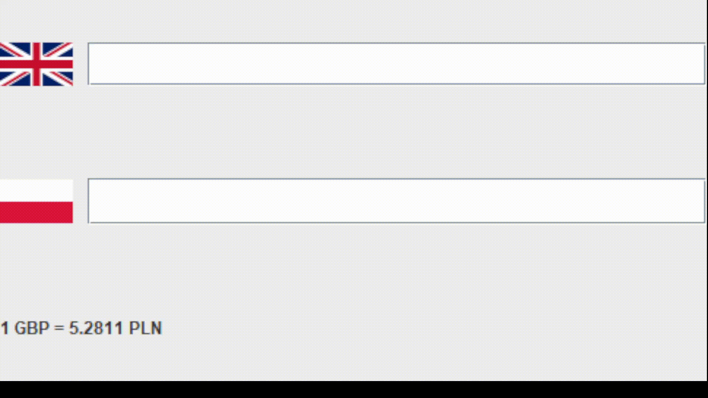

# Currency converter
Currency converter with GUI written in Java. You can convert any currency to and from PLN. Application provides rates from NBP api and flag images

## Launching the application
To run the application you will need JDK 8 or later and access to the internet. After cloning repository to your machine you need to compile files and run MainGui class.
You can provide program argument - currency code e.g. USD by that you can convert PLN and USD. If you do not provide any args, 
the default is GBP.

## Demo
